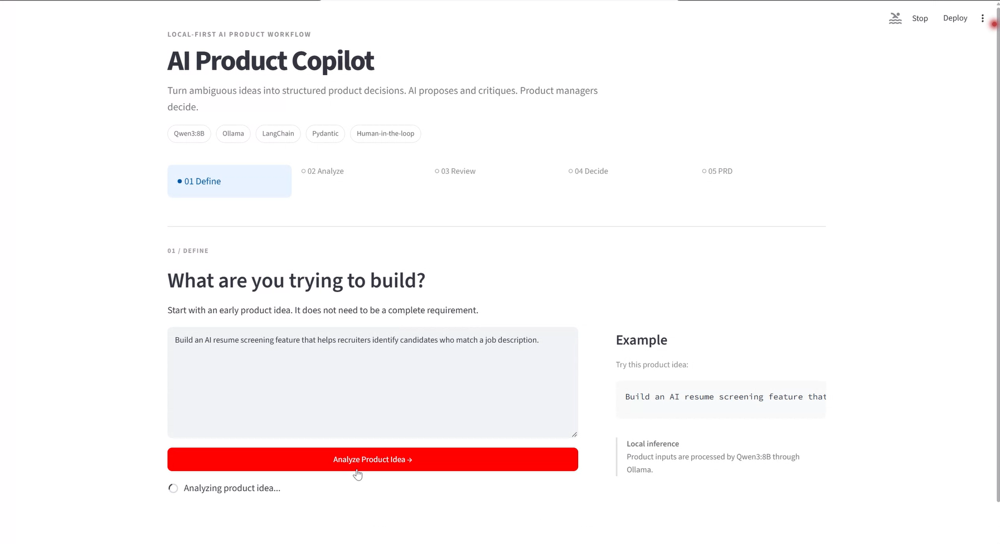
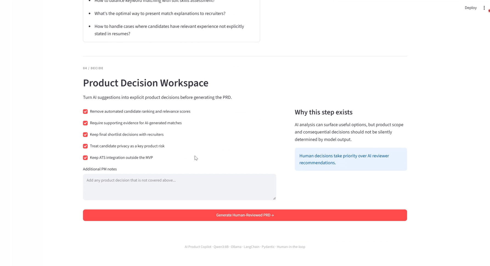
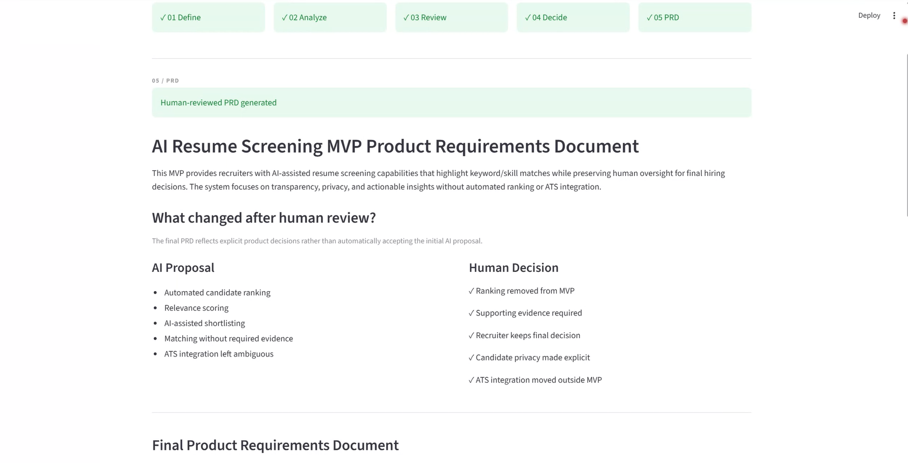
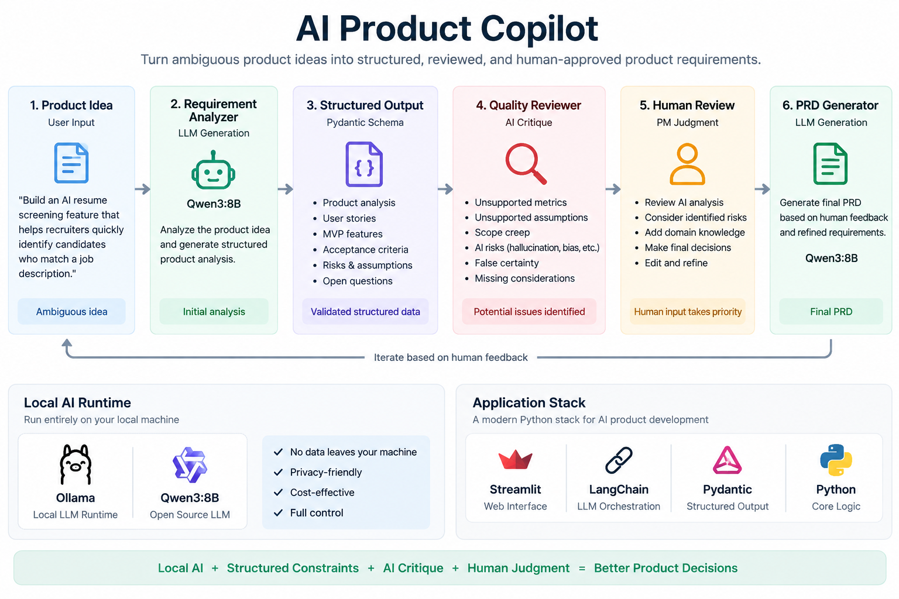

# AI Product Copilot

> **AI proposes. AI critiques. Humans decide.**

A local-first AI product workflow that turns ambiguous product ideas into
**structured analysis, explicit product decisions, and a human-reviewed PRD**.

Built with **Qwen3:8B · Ollama · LangChain · Pydantic · Streamlit**



---

## 🎬 Product Demo

### 90-second walkthrough

https://github.com/user-attachments/assets/5d24b07e-2d55-48ec-8aab-f8a30b81782c

The demo follows one complete product workflow:

**Define → Analyze → Review → Decide → PRD**

A product manager starts with an ambiguous idea, reviews AI-generated
requirements and quality warnings, makes explicit product decisions,
and generates a human-reviewed PRD.

---

## The Product

Most LLM tools stop here:

```text
Product Idea
     ↓
    LLM
     ↓
Generated PRD
```

AI Product Copilot introduces review and human decision points:

```text
Product Idea
     ↓
Structured AI Analysis
     ↓
AI Quality Review
     ↓
Human Product Decision
     ↓
Human-Reviewed PRD
```

The goal is not to let AI automatically decide what the product should be.

The goal is to use AI to accelerate product thinking while keeping
**scope, assumptions, risks, and consequential decisions visible to the PM**.

---

## 1. Define & Analyze

The PM can start with an incomplete product idea.

Example:

> Build an AI resume screening feature that helps recruiters identify
> candidates who match a job description.

Qwen3 converts the idea into structured product analysis:

- Problem
- Target users
- User stories
- MVP features
- Acceptance criteria
- Risks
- Assumptions
- Open questions

The response is constrained using a **Pydantic schema** rather than
returned as uncontrolled free-form text.

---

## 2. Review & Decide

A second AI pass critiques the initial analysis for:

- Unsupported metrics
- Unsupported assumptions
- MVP scope creep
- AI-specific risks
- False certainty
- Missing considerations

But the reviewer is deliberately treated as **advisory, not authoritative**.

The PM then turns those findings into explicit product decisions.



In the resume-screening example, the PM decides to:

- Remove automated candidate ranking and relevance scores
- Require evidence for AI-generated matches
- Keep final shortlist decisions with recruiters
- Treat candidate privacy as a key product risk
- Keep ATS integration outside the MVP

This step is intentionally designed as a **decision workspace**, rather
than another prompt box.

---

## 3. Generate the Human-Reviewed PRD

The final PRD combines:

```text
Original Product Idea
        +
Structured AI Analysis
        +
AI Quality Review
        +
Human Product Decisions
        ↓
Final PRD
```

The product also makes the impact of human review visible:



### Example: before vs. after human review

| Initial AI Proposal | Human-Reviewed Decision |
|---|---|
| Automated candidate ranking | Removed from MVP |
| Relevance scoring | Removed |
| AI-assisted shortlisting | Recruiter keeps final decision |
| Matching without required evidence | Supporting evidence required |
| ATS integration ambiguous | Explicitly outside MVP |
| Privacy not sufficiently emphasized | Candidate privacy made explicit |

The PRD can then be exported as Markdown.

---

# Why I Built This

During early testing, the LLM produced requirements that looked reasonable
but were not supported by the original product input.

For example, it generated acceptance criteria such as:

```text
80% keyword matching
5-second processing time
```

Neither target came from user research, technical validation, or the
original requirement.

That exposed the core product problem behind this project:

> **How can AI accelerate product requirement development without allowing
> generated assumptions to silently become product decisions?**

The first response was to introduce structured output.

That solved one problem—but revealed another.

---

# Key AI Product Decisions

## 1. Structured Output over Free-form Generation

The first prototype returned a Markdown document directly from the LLM.

That made the application dependent on unpredictable model formatting.

The workflow was changed to:

```text
LLM
 ↓
Pydantic Schema
 ↓
Validated Structured Data
 ↓
Application UI
```

This gives the application control over the output structure and makes
individual product fields directly usable by the UI.

---

## 2. Structural Validity ≠ Product Validity

Pydantic improved output structure, but testing revealed that the model
could still place unsupported content inside a perfectly valid schema.

For example:

```json
{
  "acceptance_criteria": [
    "The matching system should achieve 80% accuracy"
  ]
}
```

This can be structurally valid while still being an unsupported product claim.

> **Schema validation solves structural reliability, not semantic reliability.**

That observation led to the Quality Reviewer.

---

## 3. AI Reviewer as Advisor, Not Judge

A second LLM pass reviews the initial product analysis.

However, the reviewer is not assumed to be correct.

During development, the reviewer correctly identified an unsupported
numerical accuracy target—and then suggested another unsupported numerical
target in its own recommendation.

That failure mode changed the product design.

Instead of:

```text
AI generates
     ↓
AI reviews
     ↓
Automatically apply recommendation
```

the workflow became:

```text
AI generates
     ↓
AI critiques
     ↓
Human decides
```

---

## 4. Human-in-the-loop as a Product Interaction

Human review is not implemented as a disclaimer at the end of the workflow.

It is an explicit product step.

The PM can make decisions such as:

```text
Remove automated ranking from the MVP.

Require supporting evidence for AI-generated matches.

Keep the final shortlist decision with recruiters.

Treat candidate privacy as a key risk.
```

Those decisions are then passed into the final PRD generation step and
take priority over AI reviewer recommendations.

This keeps consequential product decisions under human control.

---

## 5. Workflow over One Monolithic Chain

The application is intentionally not implemented as one uninterrupted
LLM chain.

Instead, the product workflow contains separate operations:

```text
Analyze Chain
    ↓
ProductAnalysis

Review Chain
    ↓
QualityReview

Human Decision
    ↓

PRD Generation Chain
    ↓
PRD
```

This design allows:

- Intermediate outputs to be visible to the user
- Human intervention before final generation
- Independent testing of each LLM step
- Easier model replacement
- Clearer debugging of failure modes

The workflow is currently simple enough to be orchestrated with Python
and Streamlit session state.

A graph-based orchestrator such as LangGraph would become more useful if
future versions introduce conditional routing, automated retries,
research tools, or iterative review loops.

---

# Architecture



### Application workflow

```text
                         Product Idea
                              │
                              ▼
                    Requirement Analyzer
                              │
                              ▼
                     ProductAnalysis
                    (Pydantic Schema)
                              │
                              ▼
                     Quality Reviewer
                              │
                              ▼
                       QualityReview
                              │
                              ▼
                    ┌─────────────────┐
                    │  Human Product  │
                    │    Decision     │
                    └────────┬────────┘
                             │
                             ▼
                       PRD Generator
                             │
                             ▼
                         Final PRD
                             │
                             ▼
                      Markdown Export
```

### Local AI runtime

```text
Streamlit
    ↓
LangChain
    ↓
Ollama
    ↓
Qwen3:8B
```

The current prototype runs the LLM locally through Ollama.

---

# Tech Stack

| Layer | Technology | Purpose |
|---|---|---|
| LLM | Qwen3:8B | Product analysis and generation |
| Local inference | Ollama | Local model runtime |
| LLM orchestration | LangChain | Prompt + model pipelines |
| Structured output | Pydantic | Typed application data |
| UI | Streamlit | Interactive product workflow |
| Core language | Python | Application logic |

---

# Project Structure

```text
ai-product-copilot/
│
├── app.py
├── README.md
├── requirements.txt
│
├── src/
│   ├── __init__.py
│   ├── llm.py
│   ├── prompts.py
│   ├── schemas.py
│   └── workflow.py
│
├── docs/
│   └── architecture.png
│
├── screenshots/
│   ├── v3-01.png
│   ├── v3-02.png
│   └── v3-03.png
│
└── sample_data/
```

---

# Run Locally

## Prerequisites

- Python 3.10+
- Ollama
- Qwen3:8B

Pull the model:

```bash
ollama pull qwen3:8b
```

Clone the repository:

```bash
git clone https://github.com/Anonymous2127/ai-product-copilot.git
cd ai-product-copilot
```

Create a virtual environment:

```bash
python -m venv .venv
```

Activate it on Windows PowerShell:

```powershell
.\.venv\Scripts\Activate.ps1
```

Install dependencies:

```bash
pip install -r requirements.txt
```

Start the application:

```bash
streamlit run app.py
```

Then open the local Streamlit URL shown in the terminal.

---

# Current Limitations

This is an MVP designed to explore an AI-assisted product workflow rather
than a production PRD platform.

Current limitations include:

- AI-generated analysis can still contain unsupported assumptions.
- The Quality Reviewer is itself an LLM and can make incorrect recommendations.
- Structured output improves format reliability but does not guarantee factual correctness.
- Generated requirements are not grounded in real user research unless evidence is explicitly provided.
- The current Decision Workspace uses a demo-specific resume-screening decision template.
- The workflow does not yet retrieve evidence from research documents or internal knowledge bases.
- Local inference performance depends on available hardware.

These limitations are also why **human review remains part of the product architecture**.

---

# What I Would Build Next

The next iteration would focus on **grounding and evaluation**, rather than
adding autonomous agents for their own sake.

### Evidence-grounded analysis

Allow PMs to upload:

- User interviews
- Research notes
- Existing PRDs
- Customer feedback
- Competitive research

Then use retrieval to connect generated requirements to supporting evidence.

### Dynamic Decision Workspace

Instead of using a demo-specific decision template:

```text
QualityReview
      ↓
Extract Product Decisions
      ↓
Generate Context-Specific Options
      ↓
PM Accept / Reject / Defer
```

### Evaluation

Build a small evaluation dataset to measure:

- Unsupported metric detection
- Unsupported assumption detection
- Scope-creep detection
- Human instruction adherence
- PRD consistency

---

# Design Principle

> **AI should accelerate product thinking, not silently replace product judgment.**

AI Product Copilot is not designed to automatically write the “correct” PRD.

It is designed to help product managers move faster while making
**assumptions, risks, AI limitations, and human decisions more visible.**