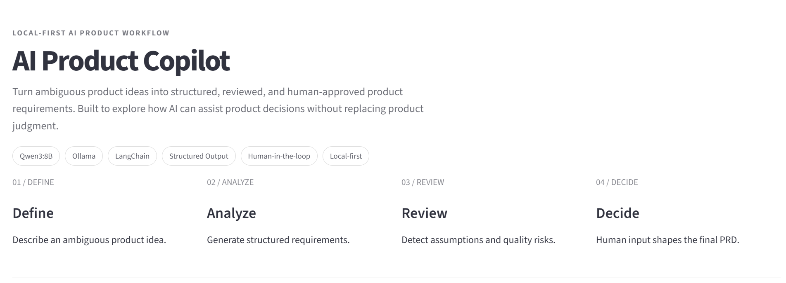
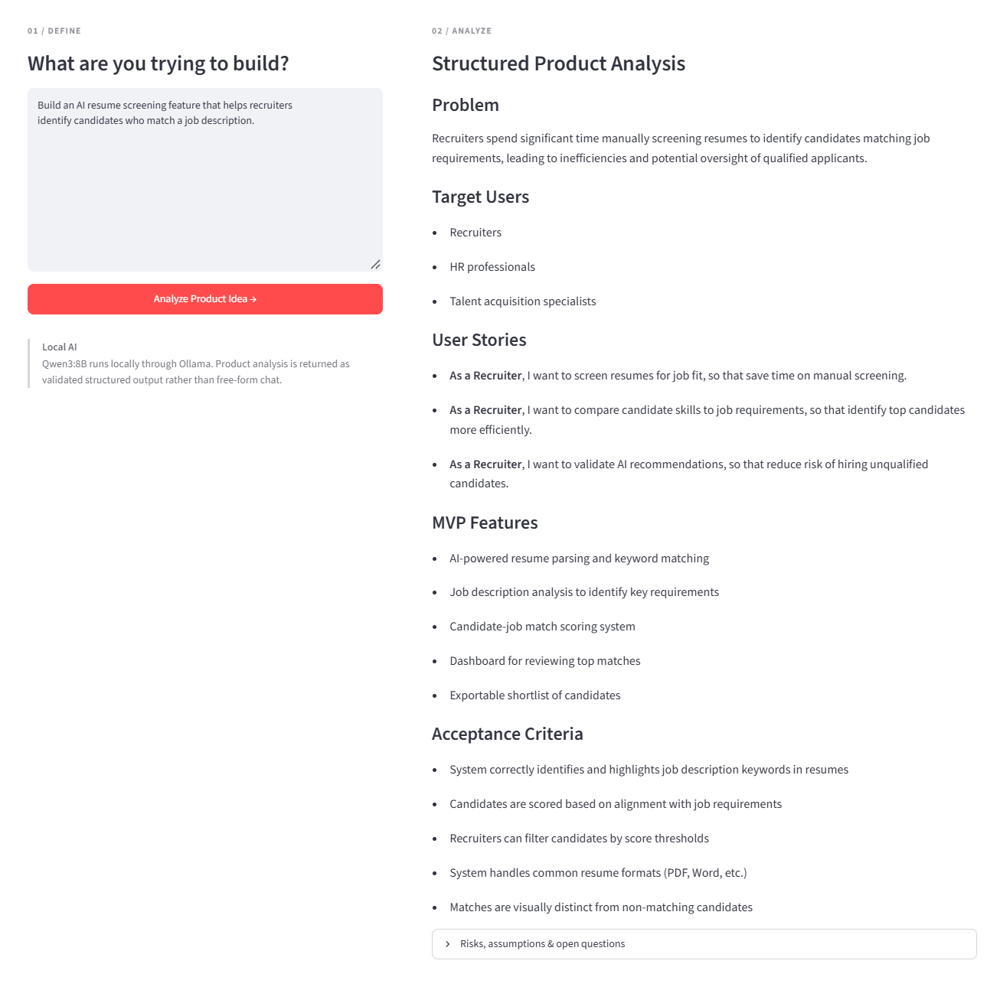
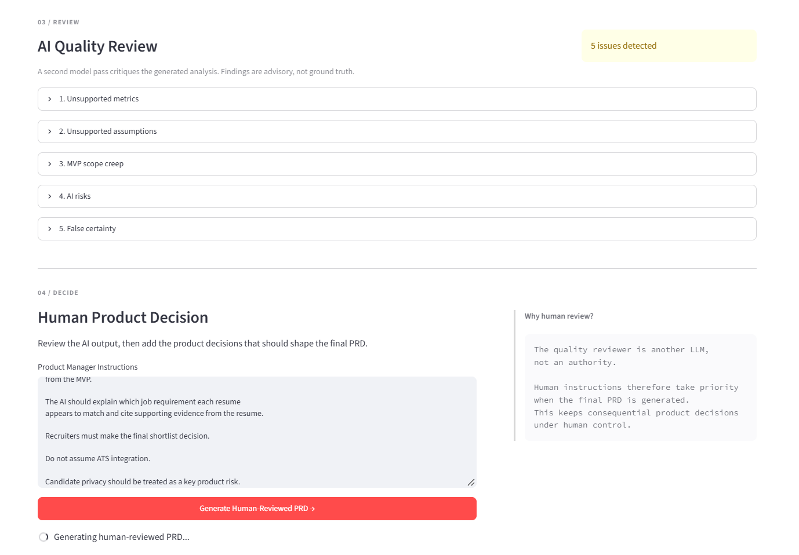
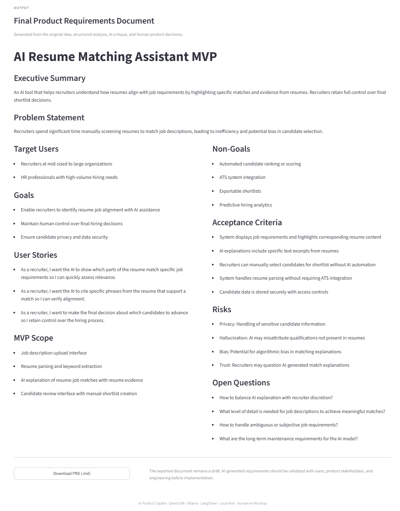

# AI Product Copilot

> Turn ambiguous product ideas into structured,
> reviewed, and human-approved product requirements.




AI Product Copilot is a local-first AI application that helps product managers transform early-stage product ideas into structured product analysis and an MVP Product Requirements Document (PRD).

Instead of treating LLM output as ground truth, the application combines **structured generation, AI quality review, and human product judgment** before producing the final artifact.

Built with **Qwen3:8B, Ollama, LangChain, Pydantic, and Streamlit**.

---
## Demo

AI Product Copilot uses a four-stage workflow:

**Define → Analyze → Review → Decide**

The system first converts an ambiguous idea into structured
product requirements.



A second AI pass critiques the analysis for unsupported metrics,
assumptions, scope creep, AI risks, and false certainty.

The product manager then reviews those findings and provides
explicit product decisions before the final PRD is generated.



The final PRD incorporates human decisions while preserving
identified risks and open questions.


---


## Why I Built This

Large language models can generate convincing product requirements quickly, but convincing output is not necessarily reliable output.

During early testing, the model generated unsupported requirements such as arbitrary accuracy targets, latency targets, and assumptions about user behavior.

For example, acceptance criteria included metrics such as:

- `80% keyword matching`
- `5-second processing time`

even though those targets were never provided by the user or supported by research.

This led to the core product question behind this project:

**How can AI accelerate product requirement development without allowing generated assumptions to silently become product decisions?**

AI Product Copilot explores a workflow where AI generates and critiques product requirements, while the product manager retains control over final decisions.

---

## Product Workflow

The application follows four main stages:

### 1. Define

The product manager enters an ambiguous product idea.

Example:

> Build an AI resume screening feature that helps recruiters identify candidates who match a job description.

### 2. Analyze

Qwen3 generates a structured product analysis including:

- Problem
- Target users
- User stories
- MVP features
- Acceptance criteria
- Risks
- Assumptions
- Open questions

The response is constrained using a **Pydantic schema** instead of relying on free-form text generation.

### 3. Review

A separate AI review step critiques the generated analysis for potential quality issues such as:

- Unsupported metrics
- Unsupported assumptions
- MVP scope creep
- AI risks
- False certainty
- Missing considerations

The reviewer is intentionally treated as an **advisory system rather than an authority**.

An AI reviewer can also hallucinate or make questionable recommendations.

### 4. Decide

The product manager reviews both the original analysis and the AI critique.

Human instructions can override AI recommendations before the final PRD is generated.

The final document can then be exported as Markdown.

---

## Architecture


The core workflow is:

```text
Product Idea
     ↓
Requirement Analyzer
     ↓
Structured ProductAnalysis
     ↓
AI Quality Reviewer
     ↓
Human Product Decision
     ↓
PRD Generator
     ↓
Final PRD
```

### Local AI Runtime

The application currently runs locally using:

- Ollama
- Qwen3:8B

This makes local experimentation possible without requiring product inputs to be sent to an external hosted LLM API.

---

## Key AI Product Decisions

### Structured Output over Free-form Generation

The first prototype returned a Markdown document directly from the LLM.

That worked for a demo, but it made the application dependent on unpredictable model formatting.

The workflow was changed to:

```text
LLM
 ↓
Pydantic Schema
 ↓
Validated Application Data
 ↓
UI
```

This separates model generation from presentation and gives the application control over the output structure.

---

### Schema Validation Does Not Guarantee Semantic Quality

Structured output solved formatting reliability, but testing revealed that the model could still produce unsupported content inside a perfectly valid schema.

For example, the model introduced numerical acceptance criteria that were never supplied by the user.

This demonstrated an important distinction:

> Structural validity is not the same as factual or product validity.

The Quality Reviewer was added to identify these semantic issues.

---

### AI Reviewer as Advisor, Not Judge

A second LLM pass reviews generated requirements.

However, the reviewer is not assumed to be correct.

During development, the reviewer correctly criticized an unsupported numerical accuracy target, but then suggested another unsupported numerical target in its own recommendation.

This reinforced the decision not to automatically apply reviewer recommendations.

Instead:

```text
AI generates
     ↓
AI critiques
     ↓
Human decides
```

---

### Human-in-the-loop

Human product instructions have higher priority than AI reviewer recommendations when generating the final PRD.

For example, a product manager can explicitly specify:

```text
Remove automated candidate ranking from the MVP.

Recruiters must make the final shortlist decision.

Show supporting resume evidence for AI-generated matches.

Do not assume ATS integration.

Treat candidate privacy as a key product risk.
```

The PRD generator then incorporates those decisions into the final document.

This keeps consequential product decisions under human control.

---

### Local-first Development

The current implementation uses Qwen3:8B through Ollama.

Reasons for choosing a local model for this prototype include:

- Fast experimentation without API integration
- Local handling of prototype inputs
- No per-request inference API cost
- Ability to explore model behavior directly
- Simple reproducible development environment

The model layer is separated from the product workflow so another LLM provider could be introduced later.

---

## Example: Human Review Changes the PRD

One test case started with an AI-generated resume-screening product concept.

The AI initially proposed:

- Candidate ranking
- Relevance scoring
- Automated filtering

During human review, the product manager instructed the system to:

- Remove automated candidate ranking
- Remove relevance scores
- Require evidence for AI-generated matches
- Keep final shortlist decisions with recruiters
- Treat candidate privacy as a key risk

The final PRD reflected these decisions by moving automated ranking into **Non-Goals**, introducing evidence-based matching, preserving human decision-making, and explicitly identifying privacy risk.

This demonstrates the intended behavior of the system:

**AI proposes. AI critiques. Humans decide.**

---

## Tech Stack

| Layer | Technology |
|---|---|
| LLM | Qwen3:8B |
| Local inference | Ollama |
| LLM orchestration | LangChain |
| Structured output | Pydantic |
| Application UI | Streamlit |
| Language | Python |

---

## Project Structure

```text
ai-product-copilot/
│
├── app.py
├── README.md
├── requirements.txt
│
├── src/
│   ├── __init__.py
│   ├── llm.py
│   ├── prompts.py
│   ├── schemas.py
│   └── workflow.py
│
├── docs/
│   └── architecture.png
│
├── screenshots/
└── sample_data/
```

---

## Run Locally

### Prerequisites

- Python
- Ollama
- Qwen3:8B

Pull the model if necessary:

```bash
ollama pull qwen3:8b
```

Clone the repository:

```bash
git clone <YOUR_REPOSITORY_URL>
cd ai-product-copilot
```

Create a virtual environment:

```bash
python -m venv .venv
```

Activate it on Windows PowerShell:

```powershell
.\.venv\Scripts\Activate.ps1
```

Install dependencies:

```bash
pip install -r requirements.txt
```

Start the application:

```bash
streamlit run app.py
```

Open the local Streamlit URL shown in the terminal.

---

## Current Limitations

This project is an MVP designed to explore an AI-assisted product workflow rather than a production PRD system.

Current limitations include:

- AI-generated analysis can still contain unsupported assumptions.
- The Quality Reviewer is itself an LLM and can produce incorrect recommendations.
- Structured output improves format reliability but does not guarantee factual correctness.
- Acceptance criteria may still contain language that requires human refinement.
- Product recommendations are not grounded in actual user research unless that evidence is provided.
- The current workflow does not yet retrieve supporting evidence from external research or internal knowledge bases.
- Local model performance depends on available hardware.

These limitations are why human review remains part of the workflow.

---

## Potential Next Steps

Future iterations could explore:

- Evidence-grounded product analysis using RAG
- Uploading user interviews and research documents
- Source citations for generated requirements
- Editable structured requirements before PRD generation
- Multiple LLM provider support
- Evaluation datasets for requirement quality
- Prompt and model comparison
- PRD version history
- Collaborative review workflows

---

## Design Principle

> AI should accelerate product thinking, not silently replace product judgment.

The goal of AI Product Copilot is therefore not to automatically write the “correct” PRD.

It is to help product managers move faster while making assumptions, risks, AI limitations, and human decisions more visible.